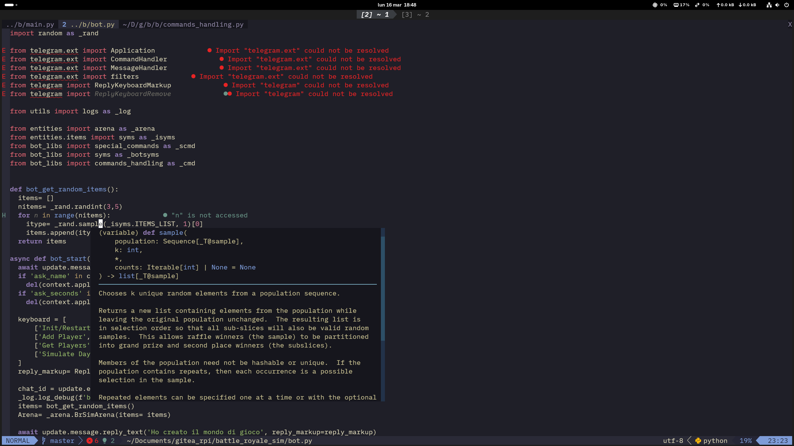
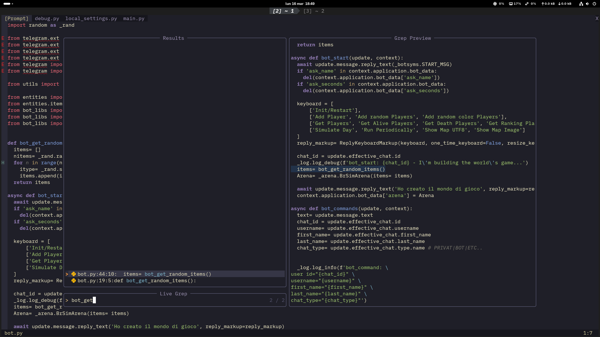

# 🌙 Crystal's Neovim Config (v0.11+)

> A professional Neovim configuration optimized for development

## 📸 Preview

## 🛠️ Dipendenze di Sistema

To ensure plugins (Mason, Telescope, Treesitter) function correctly, install the following packages via `pacman`:

    sudo pacman -S git npm ripgrep base-devel unzip nerd-fonts

- npm: Required for LSP servers like vtsls and pyright.
- ripgrep: Essential for Telescope's instantaneous file and text searching.
- base-devel: Needed to compile the native FZF extension.
- unzip: Used by Mason to extract downloaded packages.

# 📂 Configuration Structure

    .
    ├── assets                # just some screenshots
    │   ├── neovim.png
    │   └── telescope.png
    ├── init.lua              # Entry point (Leader and Requirements)
    ├── lua/
    │   ├── config/
    │   │   ├── lazy.lua      # Package Manager
    │   │   ├── keymaps.lua   # keyboard shortcuts
    │   │   └── options.lua   # neovim options
    │   └── plugins/
    │       └── init.lua      # LSP and others plugins
    └── README.md             # this file

## ⌨️ Custom Keybindings

The Leader and LocalLeader keys are set to <CR> (Enter).

### 📂 Navigazione e Tab
| Key | Action | Description |
| :--- | :--- | :--- |
| `<Tab>` | Next Tab | Switch to the next tab |
| `<S-Tab>` | Previous Tab | Switch to the previous tab |
| `<C-o>` | Open Tab | Open a new Tab (`:tabe`) |
| `<Space>` | Page Down | Scroll Down |
| `<BackSpace>` | Page Up | Scroll Up |

### 📝 Editing e Utility
| Key | Action | Description |
| :--- | :--- | :--- |
| `<C-c>` | Comment/Uncomment | Comment/Uncomment selected lines |
| `<C-h>` | No Highlight | Clean hilighted texts (`:noh`) |
| `<C-t>` | No Expand Tab | Use Tab |
| `<S-t>` | Expand Tab | Replace Tab with Spaces |
| `:Pdb` | Debug Python | Insert python pdb |
| `Scroll 🖱️` | Move Cursor | Scroll cursor with mouse wheel |

### 🔍 Telescope (Fuzzy Finder)
| Key | Action | Description |
| :--- | :--- | :--- |
| `<Leader>ff` | Find File | Search for files by name |
| `<Leader>gg` | Live Grep | Search for a string across all files |
| `<Leader>ss` | Grep String | Search for the word under the cursor |

### 🤖 LSP and Development
| Key | Action | Description |
| :--- | :--- | :--- |
| `gd` | Go to Definition | Open the definition on a **new tab** |
| `K` | Hover | Show documentation/Type under the cursor |
| `Tab` (menu) | Next Item | Navigate through completion suggestions |
| `Enter` | Confirm | Confirm the selected suggestion |

# 🖱️ Mouse and Navigation

- Mouse Wheel: Physically moves the cursor up/down (even in Insert mode!).
- Auto-remember position: When opening a file, Neovim automatically returns to the last known cursor position.

    Rotella del Mouse: Muove fisicamente il cursore j/k (anche in modalità Insert!).

    Auto-remember: All'apertura di un file, Neovim torna automaticamente all'ultima posizione del cursore.

# 🚀 Installed Plugins

- Lazy.nvim: Ultra-fast plugin manager.
- Mason: Automatic installation for pyright, bashls, vtsls, stylua, shellcheck.
- LSPConfig: Native integration for intelligent code completion.
- Kanagawa: Main colorscheme (inspired by Japanese art).
- Lualine: Elegant status line with icons and diagnostics.
- Noice & Notify: Modern and compact notification system.

# 🔌 Quick Setup (Installation)

Clone the repository into your config folder:

    git clone git@github.com:Dea1993/neovim.git ~/.config/nvim

Launch Neovim:

    nvim

Wait for Lazy to download the plugins and Mason to install the LSP servers. Restart if necessary.
